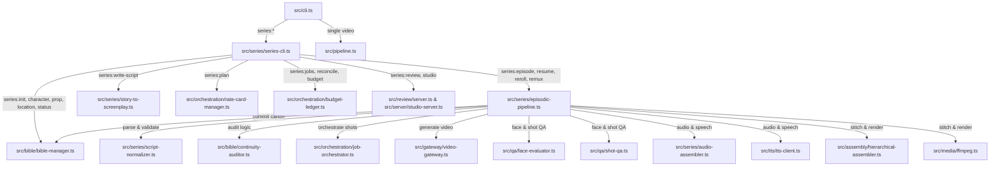

# Báo Cáo Kiểm Tra & Đánh Giá Hiện Trạng Kiến Trúc (Novel-to-Series Architecture Audit)

**Ngày thực hiện:** 2026-09-15  
**Git Commit SHA:** `a801c75` (nhánh `main`)  
**Môi trường thực thi:**  
- Hệ điều hành: Windows 11 Home Single Language (x64, 10.0.26200)
- Node.js: v22+ (hỗ trợ native `node:sqlite` DatabaseSync)
- TypeScript: 6.0.3
- Vitest: 4.1.5 (Baseline test suite: 49 test files passed, 332 tests passed, 4 skipped)
- FFmpeg/FFprobe: Chưa cấu hình trên PATH hệ thống (hệ thống vận hành đầy đủ chế độ Mock Media và Offline Fixture an toàn)
- Trạng thái Working Tree: Bảo toàn nguyên vẹn thay đổi đang có của người dùng tại `src/server/studio-ui.ts` (không can thiệp hoặc ghi đè).

---

## 1. Bản Đồ Đường Gọi Thực Tế (Execution Call Graph)

Hệ thống hiện tại có đường gọi phân lớp từ CLI tới các module sản xuất:

Chi tiết đường dẫn các thành phần cốt lõi:
1. **CLI Routing (`src/cli.ts` -> `src/series/series-cli.ts`):** Nhận diện prefix `series:<subcommand>`, phân tích options (`--series`, `--script`, `--provider`, `--dry-run`, `--resume`, `--transition`, `--hierarchical`).
2. **Story Bible Storage (`src/bible/bible-manager.ts`):** Quản lý SQLite `story_bible.db` với WAL mode, transactions (`BEGIN IMMEDIATE`), migrations v1-v5, lưu trữ metadata series, nhân vật, bối cảnh, đạo cụ, snapshots, shot takes, và 4-state budget ledger.
3. **Kịch bản & Phân cảnh (`src/series/script-normalizer.ts`):** Phân tích kịch bản text phân cảnh tiếng Việt, tách scene/shot, nhận diện thoại đa lượt, chỉ dẫn diễn xuất, kiểm định tính liên tục qua `ContinuityAuditor`.
4. **Orchestrator & Budget Guard (`src/orchestration/job-orchestrator.ts`, `budget-ledger.ts`):** Quản lý job providers, spec hasher (SHA-256 fingerprint), idempotency key, concurrency limiter, exponential backoff with jitter, 4 trạng thái chi phí (`estimated`, `reserved`, `confirmed`, `uncertain_timeout`).
5. **Video Gateway & Providers (`src/gateway/video-gateway.ts`):** Hỗ trợ `mock`, `api_kling`, `api_runway`, `api_veo`, `api_seedance`, `local_comfyui`.
6. **Kiểm định chất lượng (QA):** `FaceQaEvaluator` (ArcFace 512-D Cosine Similarity), `ShotQaEvaluator`, `visual_qa_evidence` lưu trữ bằng chứng SHA-256 không bị bypass khi thay đổi frame/ảnh tham chiếu.
7. **Dựng phim & Âm thanh:** `AudioAssembler` (ducking BGM, thoại, SFX), `HierarchicalFilmAssembler` (ghép shot -> scene -> master video theo manifest), `ffmpeg.ts` (chuẩn hóa frame, format yuv420p, pad/scale).

---

## 2. Bảng Phân Loại Khả Năng Liên Quan Đến Tiểu Thuyết & Phim Dài Tập

| Khả năng | Trạng thái hiện tại | Bằng chứng File / Hàm | Nhận xét & Đánh giá khoảng trống |
|---|---|---|---|
| **Novel Ingestion & Versioned Source Storage** | **Missing** | Chưa có module chuyên trách. `story-to-screenplay.ts:327` chỉ đọc thô 1 file qua `readFileSync`. | Thiếu bảng SQLite quản lý `sources`, `source_revisions`, content hash, lưu văn bản gốc và quy tắc chuẩn hóa. |
| **Chapter & Paragraph Chunking** | **Missing** | Không có trong codebase hiện tại. | Cần cơ chế nhận diện ranh giới chương/hồi/đoạn, chia nhỏ chương vượt context budget, giữ mapping tọa độ nguồn, ngăn trùng lặp sự kiện khi overlap. |
| **Stateful Story Analysis (Entity / Beat / Threads)** | **Partial** | `src/bible/bible-manager.ts` có bảng `characters`, `locations`, `key_props`, `world_state`. `continuity-auditor.ts` kiểm tra mâu thuẫn. | Chưa có engine phân tích tự động từ văn bản tiểu thuyết dài để trích xuất nhân vật (alias, quan hệ), beat/sự kiện, tuyến truyện (setup-payoff), và dòng tri thức (character vs audience knowledge). |
| **Series Adaptation Planning & Coverage Ledger** | **Missing** | Không có module lập kế hoạch nhiều tập. `story-to-screenplay.ts:60` chỉ sinh kịch bản cho 1 tập lẻ. | Cần `SeriesPlanner`, `CoverageLedger` ánh xạ đơn vị nguồn -> tập/cảnh, cảnh báo xung đột thời lượng/số tập, và bảo toàn mandatory beats. |
| **Episode Screenplay Generation** | **Partial** | `src/series/story-to-screenplay.ts` (`generateScreenplay`). | Hiện tại chỉ sinh 1 tập theo prompt ngắn hoặc đoạn văn, chưa nhận context từ Series Plan hay Coverage Ledger, chưa theo dõi state_in / state_out giữa các tập. |
| **Episodic Pipeline & Single-Episode Production** | **Integrated** | `src/series/episodic-pipeline.ts` (`produceEpisode`). | Hoạt động đầy đủ cho 1 tập đơn lẻ: TTS -> Audio Mix -> Shot Videos -> QA -> Stitch -> Manifest -> Canon Commit. |
| **Multi-Episode Season Orchestration** | **Partial** | `src/orchestration/job-orchestrator.ts` có thể xử lý từng shot/job. CLI chỉ có lệnh chạy từng tập lẻ `series:episode --episode N`. | Chưa có lệnh CLI điều phối toàn bộ series hoặc dải tập (ví dụ `series:season --episodes 1-5`), chưa có cơ chế tiếp tục các nhánh độc lập khi 1 tập lỗi. |
| **Hierarchical Film Assembly (Shot -> Scene -> Episode)** | **Implemented-but-unwired** | `src/assembly/hierarchical-assembler.ts`, gọi trong `episodic-pipeline.ts:1495` chỉ khi cờ `--hierarchical` bật VÀ `provider !== 'mock'`. | Khi chạy mock test hoặc mặc định chưa nối hierarchical assembler làm đường chính; cần chuẩn hóa để mock pipeline và remux cũng tận dụng triệt để manifest phân cấp. |
| **Context Builder for Script Generation** | **Partial** | `story-to-screenplay.ts:151` (`buildCanonContextSummary`). | Chỉ gom tóm tắt text ngắn từ Bible (danh sách nhân vật, đạo cụ, world state). Chưa trích xuất trích đoạn nguồn gốc (source spans), chưa xử lý flashback/thời gian phi tuyến. |
| **Review UI & Studio Dashboard** | **Integrated** | `src/review/server.ts`, `src/server/studio-server.ts`, `src/server/studio-ui.ts`. | Giao diện Studio hỗ trợ xem take, timeline, nhân vật, đạo cụ, audio stems. |

---

## 3. Rà Soát Các Rủi Ro Cũ (Từ Commit `390776f` và `c4a3904`)

| Rủi ro cũ | Tình trạng trên mã hiện tại | Bằng chứng kiểm chứng | Kết luận & Hành động |
|---|---|---|---|
| **1. Clip nguồn dài hơn shot làm mất shot sau khi ghép** | **Đã sửa & bảo vệ** | `src/assembly/hierarchical-assembler.ts:125-129`:  `trim=start=...:end=...` và `trim=duration=...`. Kiểm tra tại `hierarchical-assembler.test.ts`. | **Bảo toàn**: Test suite đã có kiểm tra cắt duration chính xác, không để clip dài xô lệch timeline. |
| **2. Migration lỗi đưa ứng dụng vào memory fallback** | **Đã sửa & bảo vệ** | `src/bible/bible-manager.ts:515-565`:  Khi `enforceStrict` (production hoặc `CLI_MODE=1`), ném `FatalSqliteError` lập tức thay vì âm thầm rơi vào memory store. | **Bảo toàn**: Đảm bảo SQLite là nguồn sự thật duy nhất, không mất dữ liệu. |
| **3. QA/approval cũ còn hiệu lực sau khi đầu vào thay đổi** | **Đã sửa & bảo vệ** | `src/bible/bible-manager.ts`: bảng `visual_qa_evidence` lưu `evidence_fingerprint = sha256(media_sha256 + reference_sha256 + prompt + model)`. Nếu byte file thay đổi, cache QA lập tức vô hiệu. | **Bảo toàn**: Duy trì cơ chế fingerprint trong các tính năng mở rộng. |
| **4. Lifecycle bị đọc chéo giữa các series** | **Đã sửa & bảo vệ** | `src/bible/bible-manager.ts`: composite key `(series_id, episode_number)` được áp dụng xuyên suốt `episode_lifecycle`, `shot_takes`, `provider_jobs`. | **Bảo toàn**: Mọi query mới về novel/source/plan phải luôn nhận `series_id`. |
| **5. Checkpoint mất cập nhật khi chạy đồng thời** | **Đã sửa & bảo vệ** | `src/bible/bible-manager.ts`: `atomicReserveShotTake` sử dụng `BEGIN IMMEDIATE TRANSACTION` và `uq_shot_takes_identity`. | **Bảo toàn**: Giữ tính nguyên tử cho mọi thao tác ghi nhận checkpoint và take reservation. |
| **6. Transition/audio khác nhau giữa produce, resume và remux** | **Đã sửa & bảo vệ** | `src/series/episodic-pipeline.ts`: Lưu `EffectiveRenderConfig` và `transitionDurationSec` vào checkpoint và timeline JSON; phân biệt rõ `0.0` tường minh với giá trị mặc định. | **Bảo toàn**: Giữ nhất quán timeline config xuyên suốt các pha dựng. |
| **7. Assembler phân cấp chưa được nối hoàn toàn vào đường sản xuất chính** | **Còn tồn tại một phần (Confirmed)** | `src/series/episodic-pipeline.ts:1495`: `HierarchicalFilmAssembler` chỉ được khởi tạo khi `options.useHierarchicalAssembly === true` VÀ `provider !== "mock"`. Khi mock hoặc không truyền cờ, pipeline dùng đường ghép crossfade/direct copy phẳng. | **Cần hoàn thiện ở P4**: Chuẩn hóa để đường sản xuất chính và mock test đều có thể dùng hierarchical assembler xuất manifest phân cấp hoàn chỉnh. |

---

## 4. Kết Luận & Kế Hoạch Triển Khai (Phases P1 - P5)

Dựa trên kết quả audit, hệ thống đã có nền tảng rất vững chắc về Story Bible SQLite, Gateway, QA, Audio Mixing và Single Episode Pipeline. Khoảng trống lớn nhất nằm ở tầng **Novel/Work Ingestion, Indexing, Series Planning, Coverage Ledger, Context Builder, và Multi-Episode Season Orchestration**.

Chúng ta sẽ triển khai theo 5 giai đoạn tiếp theo:
- **P1:** Bổ sung Migration v6 cho SQLite Bible (Source Ingestion, Chapters, Blocks, Series Plans, Coverage Ledgers, Story Beats, Story Threads, Knowledge Graph).
- **P2:** Module Ingestion & Chunking (`SourceIngestionEngine`, `TextChunker`, `StoryAnalysisEngine`, `ContextBuilder`).
- **P3:** Lập kế hoạch chuyển thể toàn bộ loạt phim (`SeriesPlanner`, `CoverageLedger`) và biên soạn kịch bản từng tập gắn kết chặt chẽ với Bible.
- **P4:** Điều phối sản xuất nhiều tập (`SeasonOrchestrator`), tích hợp `HierarchicalFilmAssembler` vào toàn bộ luồng CLI, cơ chế Invalidation Cache đa tầng.
- **P5:** Bộ kiểm thử nghiệm thu 16 nhóm (Story Fixture đa chương, flashback, alias, secret reveal, e2e offline 3 tập, recovery, budget guards, benchmark) và tài liệu bàn giao.
